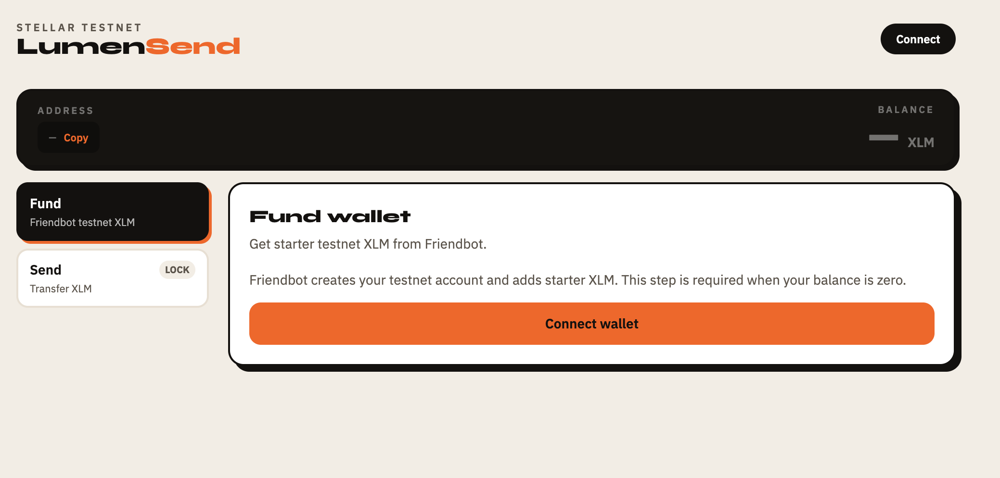
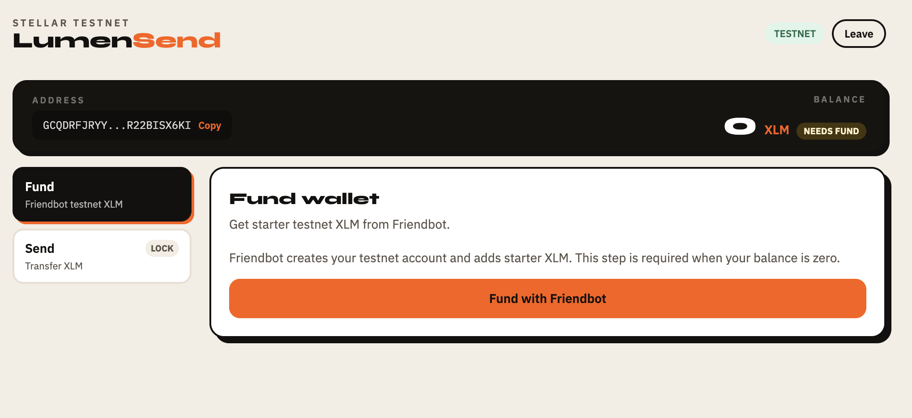
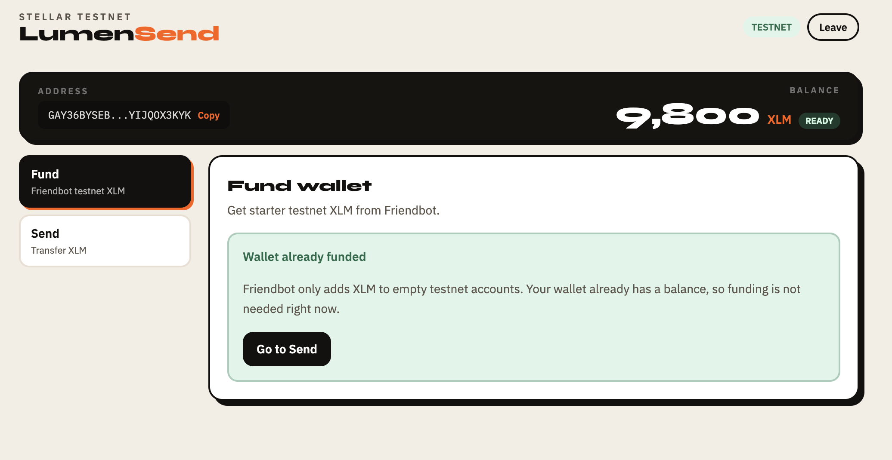
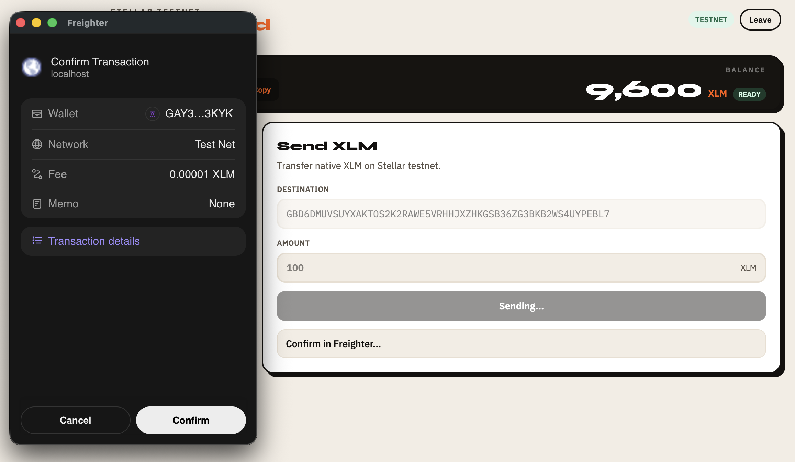
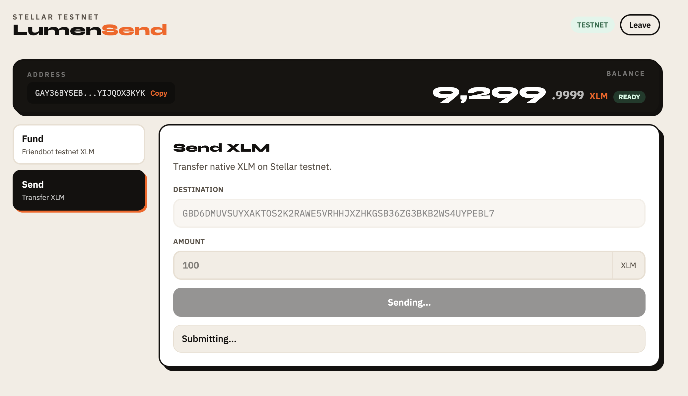
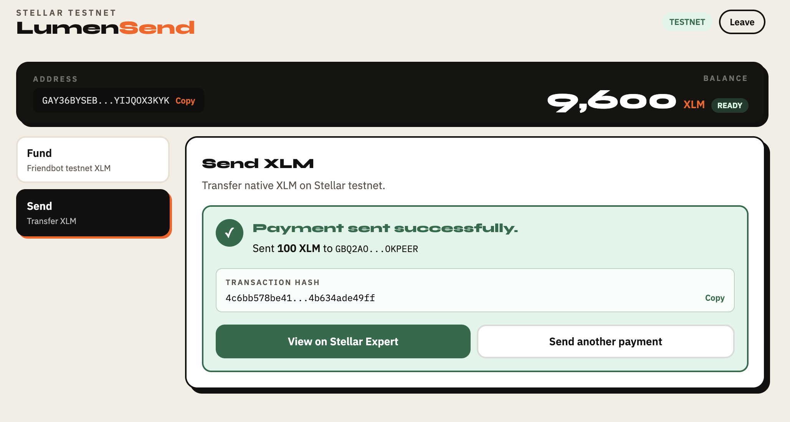

# LumenSend — Simple Payment dApp (Stellar Level 1)

LumenSend is a responsive Stellar testnet dApp for connecting a Freighter wallet, funding an account with Friendbot, and sending native XLM payments. Built with Vite, React, TypeScript, Tailwind CSS, `@stellar/freighter-api`, and `@stellar/stellar-sdk`.

## Project Description

This app demonstrates a complete Level 1 Stellar payment flow on **testnet**:

- Connect and disconnect a Freighter wallet
- Verify the wallet is on Stellar testnet
- Display the connected public address and native XLM balance
- Fund empty accounts with Friendbot
- Send XLM to another testnet address (or create a new account with at least 1 XLM)
- Show clear transaction feedback, including a success screen with hash and a Stellar Expert explorer link

The UI keeps the same layout before and after wallet connection. When no wallet is connected, action buttons prompt the user to connect first.

## Setup Instructions

### Prerequisites

- Node.js 20+
- [Freighter browser extension](https://www.freighter.app/)
- Freighter configured to **Testnet**

### Run locally

```bash
git clone <your-repo-url>
cd stellar-challanges
npm install
npm run dev
```

Open the URL shown in the terminal (default: `http://localhost:5173`).

### Test the flow

1. Open the app and click **Connect** in the header (or **Connect wallet** on Fund / Send).
2. Approve the Freighter connection request.
3. On **Fund**, click **Fund with Friendbot** if your balance is `0`.
4. Switch to **Send**, enter a destination testnet address and amount.
5. Click **Send Payment** and confirm the transaction in Freighter.
6. Review the success screen with transaction hash and open **View on Stellar Expert**.

### Other scripts

```bash
npm run build    # typecheck + production build
npm run preview  # preview production build
npm run lint     # run ESLint
```

## Screenshots

### Initial state (wallet not connected)

The app shows the same shell before connection. Address and balance are empty until Freighter is connected.



### Wallet connected state

Freighter is connected and the wallet public key is shown in the wallet bar.



### Balance displayed

After funding (or when the account already has XLM), the native balance is fetched from Horizon and displayed in the wallet bar.



### Transaction signing (Freighter)

When sending a payment, the user confirms the transaction in Freighter.



### Transaction submitting

The dApp shows progress while the signed transaction is submitted to Horizon.



### Successful testnet transaction

After Horizon accepts the transaction, the user sees a success screen instead of the form resetting.



### Transaction result shown to the user

The success screen includes the sent amount, destination, transaction hash (with copy), and a link to view the transaction on Stellar Expert.


## Level 1 Checklist

- [x] Freighter wallet setup on Stellar testnet
- [x] Wallet connect / disconnect
- [x] XLM balance fetch and display
- [x] Send XLM transaction on testnet
- [x] Transaction success/failure feedback with hash
- [x] Modular UI, wallet integration, balance fetch, transaction logic, error handling

## Project Structure

```text
src/
├── components/     # UI components (wallet bar, forms, feedback)
├── config/         # Navigation config
├── hooks/          # Freighter + balance hooks
├── layout/         # App shell and navigation
├── lib/            # Stellar config, balance, friendbot, transactions
└── views/          # Fund and Send views
```

## Network

- Horizon: `https://horizon-testnet.stellar.org`
- Friendbot: `https://friendbot.stellar.org`
- Explorer: `https://stellar.expert/explorer/testnet`

## Deploy to Vercel

1. Push this project to a public GitHub repository
2. Import the repository in [Vercel](https://vercel.com/)
3. Use these settings:
   - Framework Preset: Vite
   - Build Command: `npm run build`
   - Output Directory: `dist`
4. Deploy

The included `vercel.json` adds SPA rewrites for client-side routing.
